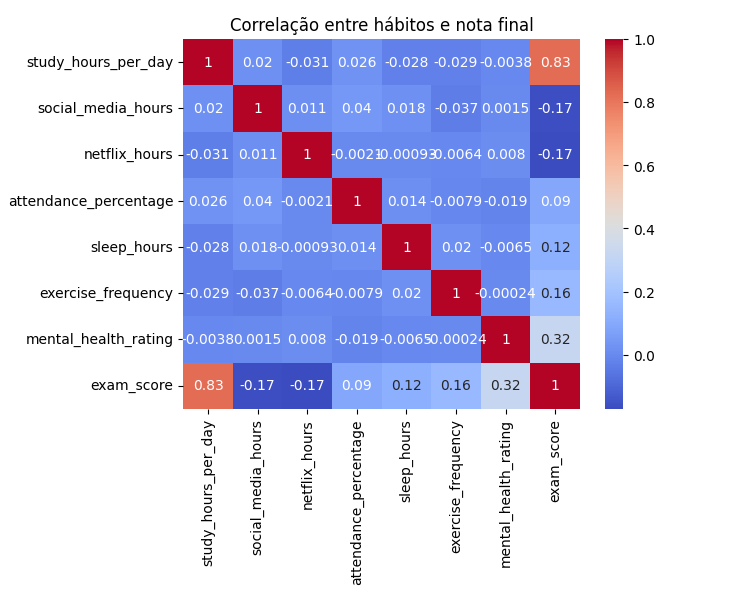
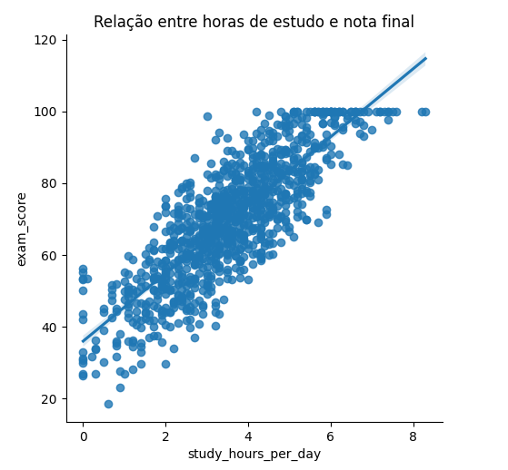
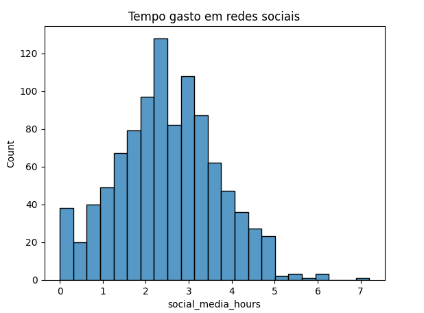
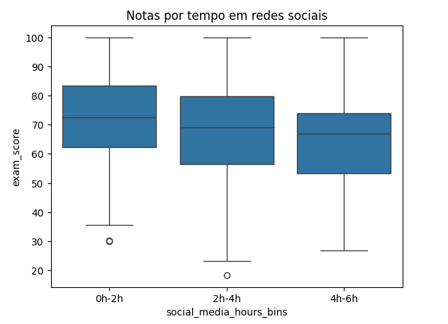
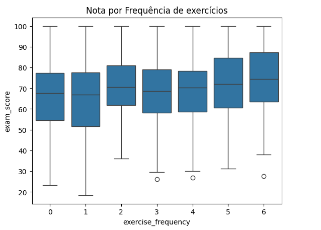
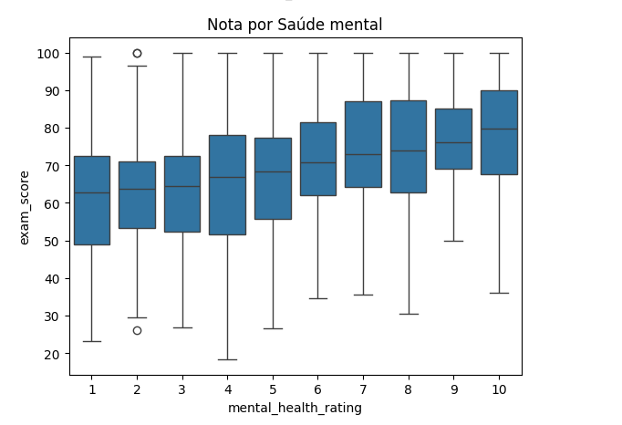
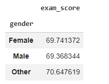

# Análise de Hábitos e Desempenho de Estudantes

Análise exploratória de dados (EDA) que investiga como hábitos diários — estudo, uso de redes sociais, sono, exercício físico, saúde mental e alimentação — se relacionam com o desempenho de estudantes em provas (`exam_score`).

## 📊 Sobre o dataset

O dataset (`student_habits_performance.csv`) contém registros de 1.000 estudantes, com colunas como:

| Coluna | Descrição |
|---|---|
| `student_id` | Identificador do aluno |
| `age`, `gender` | Idade e gênero |
| `study_hours_per_day` | Horas de estudo por dia |
| `social_media_hours` | Horas em redes sociais por dia |
| `netflix_hours` | Horas assistindo Netflix por dia |
| `part_time_job` | Se o aluno tem emprego parcial |
| `attendance_percentage` | Percentual de frequência nas aulas |
| `sleep_hours` | Horas de sono por dia |
| `diet_quality` | Qualidade da alimentação |
| `exercise_frequency` | Frequência de exercícios físicos |
| `parental_education_level` | Nível de escolaridade dos pais |
| `mental_health_rating` | Avaliação de saúde mental |
| `exam_score` | Nota final na prova (variável alvo) |

## 🛠️ Ferramentas utilizadas

- **Python** (Google Colab)
- **pandas** — manipulação e filtragem dos dados
- **seaborn** e **matplotlib** — visualização de dados

## 🔍 Perguntas analisadas

1. Quais hábitos mais impactam o desempenho dos alunos?
2. Estudar mais realmente melhora a nota?
3. O tempo gasto em redes sociais afeta o desempenho?
4. Exercício físico, saúde mental e boa alimentação aumentam o desempenho?
5. Existe diferença de desempenho entre gêneros?

## 📈 Principais descobertas

### Correlação entre hábitos e nota final

Um heatmap de correlação foi gerado para identificar quais variáveis mais se relacionam com `exam_score`:



- **`study_hours_per_day`** tem correlação forte e positiva (**0.83**) com a nota — de longe o fator mais relevante
- **`mental_health_rating`** tem correlação moderada positiva (**0.32**)
- **`exercise_frequency`** (0.16) e **`sleep_hours`** (0.12) têm correlação fraca positiva
- **`attendance_percentage`** tem correlação surpreendentemente fraca (0.09)
- **`social_media_hours`** e **`netflix_hours`** têm correlação fraca negativa (-0.17 cada)

### Horas de estudo vs. nota



Comparando grupos extremos de horas de estudo diárias:

- Alunos que estudam **mais de 5h/dia**: média de **90.8** pontos
- Alunos que estudam **menos de 2h/dia**: média de **45.6** pontos

Uma diferença de mais de **45 pontos** entre os grupos, reforçando o forte peso do hábito de estudo no desempenho.

### Redes sociais



A maior parte dos alunos passa entre 1h e 4h por dia em redes sociais.



O tempo em redes sociais foi segmentado em faixas (0h-2h, 2h-4h, 4h-6h) e comparado via boxplot com a nota final, mostrando uma tendência de queda no desempenho conforme aumenta o tempo de uso.

### Exercício físico, saúde mental e alimentação






<!-- ⚠️ substituir esta imagem: o arquivo enviado está duplicado com o gráfico de redes sociais -->

Boxplots por `exercise_frequency`, `mental_health_rating` e `diet_quality` mostram que esses hábitos têm alguma relação minimamente positiva com a nota.

### Desempenho por gênero



A média de notas é bastante próxima entre os grupos, sem diferença expressiva.

## 📁 Estrutura do repositório

```
├── Analise_estudantes.ipynb   # Notebook com todo o código e gráficos
├── student_habits_performance.csv   # Dataset utilizado
├── imagens/                   # Gráficos exportados do notebook
│   ├── Correlação-habitos-nota.png
│   ├── estudo-nota.png
│   ├── tempo-redes-sociais.png
│   ├── notas-tempo-redesocial.png
│   ├── nota-exercicio.png
│   ├── nota-saude-mental.png
│   ├── nota-dieta.png
│   └── estatistica-genero.png
└── README.md
```

## ▶️ Como executar

1. Clone este repositório
2. Abra o `Analise_estudantes.ipynb` no [Google Colab](https://colab.research.google.com/) ou Jupyter
3. Faça upload do `student_habits_performance.csv` (ou ajuste o caminho no código)
4. Execute as células em ordem

## ✅ Conclusão

O hábito com maior impacto no desempenho dos alunos é, de forma clara, o **tempo dedicado ao estudo**. Fatores como saúde mental, sono e exercício físico contribuem positivamente, mas de forma bem mais discreta. Já o tempo excessivo em redes sociais e streaming mostra uma leve relação negativa com a nota final.
